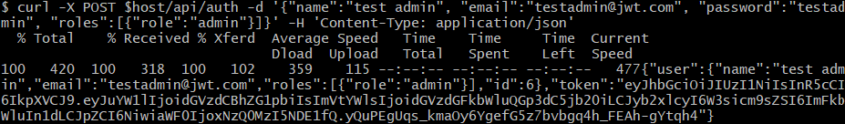
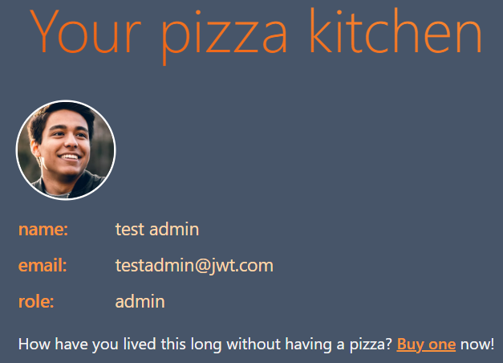
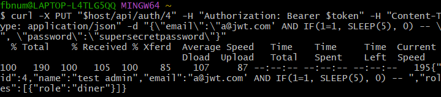

# Peer Test 05/11/2025
## Kate Hill and Dylan Shuldberg

## Self Attack
### Kate:
| Item | Result|
| --- | --- |
| Date | April 10, 2025 |
| Target | pizza.rundiary.click |
| Classification | Security Misconfiguartion |
| Severity | 2 |
| Description | Default admin login still in use. Gained admin access. |
| Image |  |
| Corrections | Remove default users, add new admin with secure login. |

| Item | Result|
| --- | --- |
| Date | April 10, 2025 |
| Target | pizza.rundiary.click |
| Classification | Injection |
| Severity | 1 |
| Description | SQL injection changed all users to have new username and password. Gained admin access and all accounts are unusable. |
| Image |  |
| Corrections | Parameterize SQL statement to update user. |

### Dylan:

| Item | Result|
| --- | --- |
| Date | April 10, 2025 |
| Target | pizza.shuldberg.click |
| Classification | Broken Access Control |
| Severity | 2 |
| Description | Admin accounts can be inserted without authentication. |
| Image |   |
| Corrections | Remove functionality that was added to registration to allow other roles. |

| Item | Result|
| --- | --- |
| Date | April 10, 2025 |
| Target | pizza.shuldberg.click |
| Classification | Security Misconfiguration |
| Severity | 2 |
| Description | Admin account uses default password. |
| Image |  |
| Corrections | Changed default password and reset database. |

| Item | Result|
| --- | --- |
| Date | April 10, 2025 |
| Target | pizza.shuldberg.click |
| Classification | Injection |
| Severity | 3 |
| Description | Update user endpoint does not sanitize email field for SQL.  |
| Image |    |
| Corrections | Used a prepared statement instead of concatenation. |

| Item | Result|
| --- | --- |
| Date | April 10, 2025 |
| Target | pizza.shuldberg.click |
| Classification | Security Misconfiguration |
| Severity | 4 |
| Description | Stack trace exposed to user. |
| Image |  |
| Corrections | Removed stack trace from output. |

| Item | Result|
| --- | --- |
| Date | April 10, 2025 |
| Target | pizza.shuldberg.click |
| Classification | Security Misconfiguration |
| Severity | 4 |
| Description | Docs page exposed to user. |
| Image |  |
| Corrections | Removed docs page. |

| Item | Result|
| --- | --- |
| Date | April 10, 2025 |
| Target | pizza.shuldberg.click |
| Classification | Broken Access Control |
| Severity | 3 |
| Description | Free pizzas acquired by modifying the HTTP request. |
| Image |   |
| Corrections | Attempted to rely on price in database instead of from client. |

## Peer Attack
### Kate attack on Dylan:
| Item | Result|
| --- | --- |
| Date | April 11, 2025 |
| Target | pizza.shuldberg.click |
| Classification | Security Misconfiguartion |
| Severity | None |
| Description | Attempted default admin login, not recognized. |
| Image |  |
| Corrections | None |

| Item | Result|
| --- | --- |
| Date | April 11, 2025 |
| Target | pizza.shuldberg.click |
| Classification | Injection |
| Severity | None |
| Description | SQL injection attempted but safeguarded against. |
| Image |  |
| Corrections | None |

### Dylan attack on Kate:

| Item | Result|
| --- | --- |
| Date | April 11, 2025 |
| Target | pizza.rundiary.click |
| Classification | Security Misconfiguration |
| Severity | None |
| Description | Attempted default admin login. No effect. |
| Image |  |
| Corrections | None |

| Item | Result|
| --- | --- |
| Date | April 11, 2025 |
| Target | pizza.rundiary.click |
| Classification | Broken Access Control |
| Severity | None |
| Description | Attempted inserting admin. No effect. |
| Image |  |
| Corrections | None |

| Item | Result|
| --- | --- |
| Date | April 11, 2025 |
| Target | pizza.rundiary.click |
| Classification | Security Misconfiguration |
| Severity | 4 |
| Description | Gained access to the docs page |
| Image |  |
| Corrections | Consider removing public access to docs. |

| Item | Result|
| --- | --- |
| Date | April 11, 2025 |
| Target | pizza.rundiary.click |
| Classification | Broken Access Control |
| Severity | 3 |
| Description | Free pizzas acquired by modifying the HTTP request. |
| Image |    |
| Corrections | Consider referencing database value instead fo request value. |

| Item | Result|
| --- | --- |
| Date | April 11, 2025 |
| Target | pizza.rundiary.click |
| Classification | Injection |
| Severity | None |
| Description | Attempted cross-site scripting. No effect. |
| Image |  |
| Corrections | None |

| Item | Result|
| --- | --- |
| Date | April 11, 2025 |
| Target | pizza.rundiary.click |
| Classification | Injection |
| Severity | None |
| Description | Attempted SQL injection. No effect. |
| Image |  |
| Corrections | None |

## Summary
We both found and protected against the vulnerabilites of the default admin login and SQL exploit in the updateUser endpoint. Through self-testing and fixing these vulnerabilities on our own applications, we learned to protect admin login credentials and the power of parameterized inputs for SQL statements.  
As we tested each other's applications, we were not able to penetrate either application in a significant way because we had both found and fixed the same vulnerabilites.
